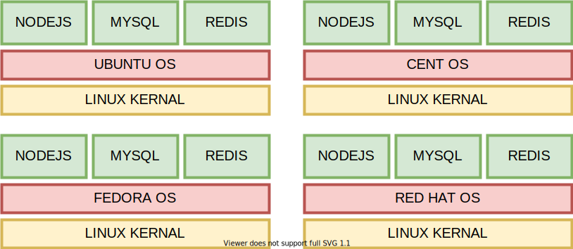
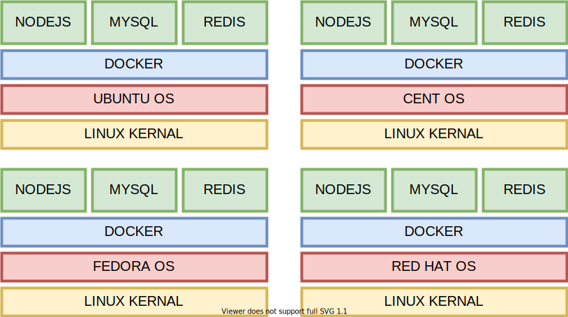
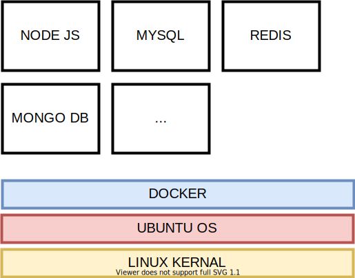

# Docker

Docker is a software that simplifies the process of managing (running, creating, configuring etc..) containers easy. It helps to promote _DevOps_ Culture.

## History

The two teams are required for proper functioning of the software

| Team                  | Worked on            | Description                                  |
| --------------------- | -------------------- | -------------------------------------------- |
| Developers            | Application Software | Developed apps using nodejs, html, css, etc. |
| System Administrators | Operating System     | Configured **OS** to run the provided app    |

So, let's consider our developers built a app using technologies:

| Technology | Purpose                                        |
| ---------- | ---------------------------------------------- |
| Nodejs     | handle user requests                           |
| mysql      | provides database storage for app              |
| redis      | provided key value store for app configuration |

The app was ready to be deployed, so the team of developers, asked system administrators to configure the **OS** to with required dependencies of our app.

The system administrators faced the issue with the setup, because the exact version of mysql required by the application was not available for ubuntu, or fedora or whatever flavour of linux the app needs to be configured on. The administrator decided to install another flavour of operating system with the supported mysql version. This process was quite time consuming.

Now, our app developers decided to upgrade redis to latest version, and the app was once again provided to administrators to setup. The same problem arised again. So, administrators somehow managed to do the task.(this is not the important point, the point is the permanent solution to the problem).

To solve the problem, docker came in existance. Will will disect the above story and root cause of the problem in next step.

## Problem + Solution

The current scenerio is something like this:

<figure>
    
    <figcaption>Diagram of os running application</figcaption>
</figure>

The problem in the scenerio is the flavour of operating system that talks with the kernal. So, let's think of some approach to solve this problem. The possible solutions could be:

To write some software that talks to the kernal directly irrespecive of the linux flavour. So the picture would be something like this:

<figure>
    
    <figcaption>solution</figcaption>
</figure>

Now, we understand what exactly is docker! Let's move on talk a little bit more about docker.

## Installation

We assume that you are using some flavour of linux operating system. Docker is available for mac and windows, but as most of the internet is powered by linux web servers, so docker has robust and stable support for linux kernal.

> You cannot run docker on windows, instead if you follow the docs, then the the installer creates a linux virtual machine on windows, which then contains docker installation. So it is achieved by virtualisation.

To install docker <a href="https://www.docker.com/" target="_blank" title="docker docs">visit Docker website</a> or visit ubuntu linux install instructions at: [https://docs.docker.com/engine/install/ubuntu/].(https://docs.docker.com/engine/install/ubuntu/).

From reading the docs we found the following commands will help you install docker on your machine:

```sh
$ curl -fsSL https://get.docker.com -o get-docker.sh
$ sudo sh get-docker.sh
```

then, configure the docker for not root user:

```sh
$ sudo usermod -aG docker your-username
```

There are also security concerns when you configure docker for non root users, docs suggests it as:

> Adding a user to the “docker” group grants them the ability to run containers which can be used to obtain root privileges on the Docker host. Refer to Docker Daemon Attack Surface for more information.

## Basic Terminologies

Now, to understand docker docker let's continue our discussion about the problem, docker tried to solve.

The problem was : _conflicting versions of application dependencies on different linux flavours_.

<!-- TODO -->

<!--
### Containers

Think of containers as the boxes, holding your apps. They help you create a virtual space in your disk holding all your required softwares and libraries.

To clarify the above statement, let's take an example:

A developer wants to build an app that uses the following dependencies:

| Dependency | Purpose                              |
| ---------- | ------------------------------------ |
| nodejs     | Handles user requests                |
| mysql      | Stores user data in tables           |
| mongodb    | Stores user data in non sql database |
| redis      | Stores user preferences              |

Let's convert the above scenerio to an image:

<figure>
    
    <figcaption>Containers Example</figcaption>
</figure>

So, the above figure demonstrates that _container is just an isolation between processes_. The picture demonstrates that:

1. First container runs instance of `nodejs` and `mysql`
2. Second container runs instance of `mongodb` and multiple other apps if you need to.
3. The third container runs an instance of `redis` database. -->
